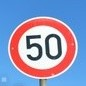
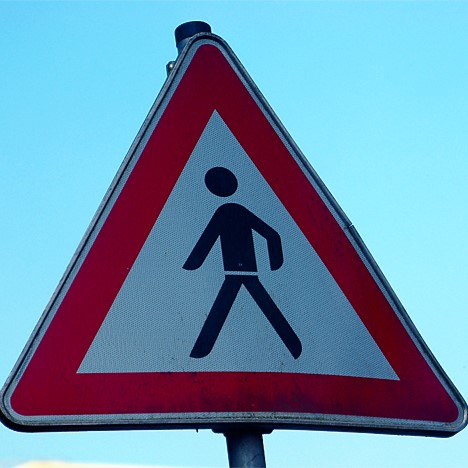
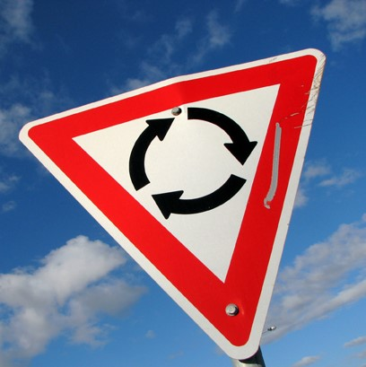
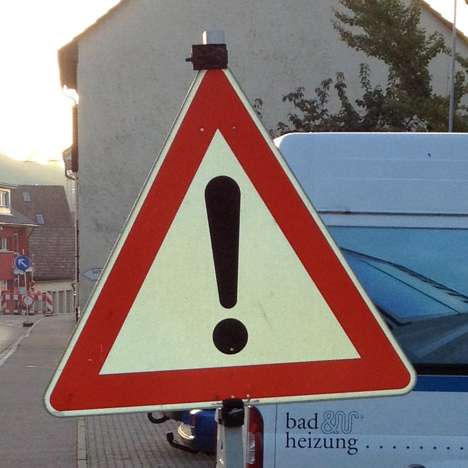
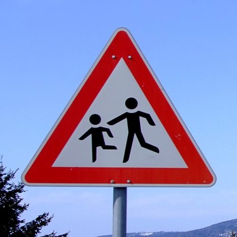

#**Traffic Sign Recognition** 

##Writeup
---

**Build a Traffic Sign Recognition Project**

The goals / steps of this project are the following:
* Load the data set (see below for links to the project data set)
* Explore, summarize and visualize the data set
* Design, train and test a model architecture
* Use the model to make predictions on new images
* Analyze the softmax probabilities of the new images
* Summarize the results with a written report

[//]: # (Image References)

[image1]: ./new_images/counts.png "counts"
[image2]: ./new_images/grayscale.png "grayscale"
[image3]: ./examples/random_noise.jpg "Random Noise"
[image4]: ./new_images/0.jpg "0" 
[image5]: ./new_images/1.jpg "1"
[image6]: ./new_images/2.jpg "2"
[image7]: ./new_images/3.jpg "3"
[image8]: ./new_images/4.jpg "4"

## Rubric Points
###Here I will consider the [rubric points](https://review.udacity.com/#!/rubrics/481/view) individually and describe how I addressed each point in my implementation.  

---
###Writeup / README

####1. Provide a Writeup / README that includes all the rubric points and how you addressed each one. You can submit your writeup as markdown or pdf. You can use this template as a guide for writing the report. The submission includes the project code.

You're reading it! and here is a link to my [project code](https://github.com/oezhouyou/CarND-Traffic-Sign-Classifier-Project/blob/master/Traffic_Sign_Classifier.ipynb)

###Data Set Summary & Exploration

####1. Provide a basic summary of the data set. In the code, the analysis should be done using python, numpy and/or pandas methods rather than hardcoding results manually.

I used the pandas library to calculate summary statistics of the traffic
signs data set:

* The size of training set is 34799
* The size of the validation set is 4410
* The size of test set is 12630
* The shape of a traffic sign image is (32, 32, 3)
* The number of unique classes/labels in the data set is 43

####2. Include an exploratory visualization of the dataset.

Here is an exploratory visualization of the data set. It is a bar chart showing how the data is distributed around 43 different sign categories. The images clearly are not evenly collected by each type of signs.

![alt text][image1]

###Design and Test a Model Architecture

####1. Describe how you preprocessed the image data. What techniques were chosen and why did you choose these techniques? Consider including images showing the output of each preprocessing technique. Pre-processing refers to techniques such as converting to grayscale, normalization, etc. (OPTIONAL: As described in the "Stand Out Suggestions" part of the rubric, if you generated additional data for training, describe why you decided to generate additional data, how you generated the data, and provide example images of the additional data. Then describe the characteristics of the augmented training set like number of images in the set, number of images for each class, etc.)

As a first step, I decided to convert the images to grayscale because grayscale images have less color channels and could potiential highlight the learning features.

Here is an example of a traffic sign image after grayscaling.

![alt text][image2]

Later, I normalized the image data because standardized features make the learning process treating each of them equally.

####2. Describe what your final model architecture looks like including model type, layers, layer sizes, connectivity, etc.) Consider including a diagram and/or table describing the final model.

My final model consisted of the following layers:

| Layer         		|     Description	        					| 
|:---------------------:|:---------------------------------------------:| 
| Input         		| 32x32x1 grayscale image   					| 
| Convolution 5x5     	| 1x1 stride, valid padding, outputs 28x28x6 	|
| RELU					|												|
| Max pooling	      	| 2x2 stride, outputs 14x14x6 					|
| Convolution 5x5	    | 1x1 stride, valid padding, outputs 10x10x16 	|
| RELU					|												|
| Max pooling	      	| 2x2 stride, outputs 5x5x16 					|
| Fully connected		| Inputs 400, outputs 120						|
| RELU					|												|
| Fully connected		| Inputs 120, outputs 84						|
| RELU					|												|
| Fully connected		| Inputs 84, outputs 43   						|
 

####3. Describe how you trained your model. The discussion can include the type of optimizer, the batch size, number of epochs and any hyperparameters such as learning rate.

To train the model, I used an Adam optimizer with learning rate 0.001, EPOCHS 50, BATCH_SIZE 128.

####4. Describe the approach taken for finding a solution and getting the validation set accuracy to be at least 0.93. Include in the discussion the results on the training, validation and test sets and where in the code these were calculated. Your approach may have been an iterative process, in which case, outline the steps you took to get to the final solution and why you chose those steps. Perhaps your solution involved an already well known implementation or architecture. In this case, discuss why you think the architecture is suitable for the current problem.

My final model results were:
* training set accuracy of 1.000
* validation set accuracy of 0.939
* test set accuracy of 0.924

* What architecture was chosen?
LeNet is chosen as my learning architecture
* Why did you believe it would be relevant to the traffic sign application?
LeNet has outstanding reputation on image classifications and pretty fast, which is good for tuning.
* How does the final model's accuracy on the training, validation and test set provide evidence that the model is working well?
The training set accuracy is quite close to 1.00 after 40 iteration and both validation and test set accuracy is above 0.92 which shows LeNet is efficient to archive a relative good baseline.

 

###Test a Model on New Images

####1. Choose five German traffic signs found on the web and provide them in the report. For each image, discuss what quality or qualities might be difficult to classify.

Here are five German traffic signs that I found on the web:

The first image might be difficult to classify because the sign doesn't contain clear pixel features after resize.

####2. Discuss the model's predictions on these new traffic signs and compare the results to predicting on the test set. At a minimum, discuss what the predictions were, the accuracy on these new predictions, and compare the accuracy to the accuracy on the test set (OPTIONAL: Discuss the results in more detail as described in the "Stand Out Suggestions" part of the rubric).

Here are the results of the prediction:

| Image			        |     Prediction	        					| 
|:---------------------:|:---------------------------------------------:| 
| Speed limit (50km/h) 	| Speed limit (50km/h)   						| 
| Pedestrians     		| Pedestrians 									|
| Roundabout mandatory	| Speed limit (60km/h)							|
| General caution 		| General caution		 						|
| Children crossing		| Children crossing     						|

The model was able to correctly guess 4 of the 5 traffic signs, which gives an accuracy of 80%. This compares favorably to the accuracy on the test set of 92.4%

####3. Describe how certain the model is when predicting on each of the five new images by looking at the softmax probabilities for each prediction. Provide the top 5 softmax probabilities for each image along with the sign type of each probability. (OPTIONAL: as described in the "Stand Out Suggestions" part of the rubric, visualizations can also be provided such as bar charts)

For the first image, the model is relatively sure that this is a Speed limit (50km/h) sign (probability of 57.6%), and the image does contain a Speed limit (50km/h) sign. The top five soft max probabilities were

| Probability         	|     Prediction	        					| 
|:---------------------:|:---------------------------------------------:| 
| .58         			| Speed limit (50km/h)   						| 
| .31     				| Wild animals crossing 						|
| .15					| Slippery road									|
| .15	      			| Speed limit (30km/h)					 		|
| .13				    | Speed limit (80km/h)      					|

For the second image, the model is relatively sure that this is a Pedestrians sign (probability of 0.47), and the image does contain a Pedestrians sign. The top five soft max probabilities were

| Probability         	|     Prediction	        					| 
|:---------------------:|:---------------------------------------------:| 
| .47         			| Pedestrians    								| 
| .31     				| General caution 								|
| .24					| Right-of-way at the next intersection			|
| .20	      			| Road work					 					|
| .17				    | Road narrows on the right      				|

For the third image, the model is relatively sure that this is a Speed limit (60km/h) sign (probability of 0.54), and the image does contain a Roundabout mandatory sign. The top five soft max probabilities were

| Probability         	|     Prediction	        					| 
|:---------------------:|:---------------------------------------------:| 
| .54         			| Speed limit (60km/h)   						| 
| .43     				| Yield 										|
| .39					| No passing for vehicles over 3.5 metric tons	|
| .31	      			| No pass						 				|
| .31				    | Turn left ahead      							|

For the fourth image, the model is relatively sure that this is a General caution sign (probability of 0.99), and the image does contain a General caution sign. The top five soft max probabilities were

| Probability         	|     Prediction	        					| 
|:---------------------:|:---------------------------------------------:| 
| .99         			| General caution   							| 
| .68     				| Traffic signals 								|
| .49					| Pedestrians									|
| .36	      			| Children crossing					 			|
| .29				    | Go straight or left      						|

For the fifth image, the model is relatively sure that this is a Children crossing sign (probability of 0.6), and the image does contain a Children crossing sign. The top five soft max probabilities were

| Probability         	|     Prediction	        					| 
|:---------------------:|:---------------------------------------------:| 
| .59         			| Children crossing   							| 
| .29     				| General caution 								|
| .15					| Double curve									|
| .12	      			| Turn left ahead					 			|
| .11				    | Pedestrians      								|

